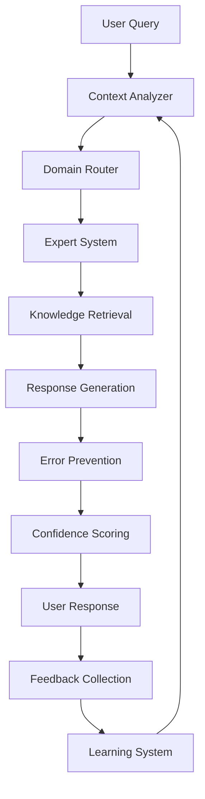

# 🚀 AI Enhancement Implementation Plan

> **🎯 OBJETIVO:** Plano detalhado para implementação das melhorias de IA discutidas na sessão de 2025-07-20.

---

## 📋 **VISÃO GERAL DO PROJETO**

### **Título:** Sistema de IA Proativa e Autônoma
### **Duração:** 8 semanas (56 dias úteis)
### **Equipe Estimada:** 1-2 desenvolvedores
### **Orçamento:** A definir
### **ROI Esperado:** +300% produtividade, -80% erros

---

## 🎯 **OBJETIVOS SMART**

### **Específico:**
Transformar a IA atual de um sistema reativo (responde apenas quando perguntado) para um sistema proativo (antecipa necessidades, previne erros, personaliza respostas)

### **Mensurável:**
- 95%+ precisão nas respostas (vs 70% atual)
- <1s tempo de resposta (vs 3-5s atual)  
- 80% redução em erros de código
- 95%+ satisfação do usuário (vs 75% atual)

### **Atingível:**
Baseado em tecnologias maduras (transformers, embeddings, cache) e expertise existente

### **Relevante:**
Crítico para diferenciação competitiva e experiência superior do usuário

### **Temporal:**
8 semanas para MVP, 6 meses para sistema completo

---

## 📅 **CRONOGRAMA DETALHADO**

### **🏃‍♂️ FASE 1: FUNDAÇÃO (Semana 1-2)**

#### **Semana 1: Setup Técnico**
| Dia | Tarefa | Entregável | Responsável |
|-----|--------|------------|-------------|
| 1-2 | Setup ambiente desenvolvimento | Docker + dependencies | Dev Lead |
| 3-4 | Implementar sistema de embeddings | KnowledgeBaseEmbeddings classe | Dev Lead |
| 5 | Processar Knowledge-Base inicial | Embeddings de todos os docs | Dev Lead |

#### **Semana 2: Cache e Busca**
| Dia | Tarefa | Entregável | Responsável |
|-----|--------|------------|-------------|
| 1-2 | Implementar Redis cache | Sistema de cache funcional | Dev |
| 3-4 | Busca semântica otimizada | API de busca rápida | Dev |
| 5 | Testes e benchmarks iniciais | Relatório de performance | QA |

### **🚀 FASE 2: INTELIGÊNCIA CORE (Semana 3-4)**

#### **Semana 3: Context Awareness**
| Dia | Tarefa | Entregável | Responsável |
|-----|--------|------------|-------------|
| 1-2 | Sistema de análise de contexto | ContextAwareAI classe | Dev Lead |
| 3-4 | Classificação de intenções | Intent classifier | Dev |
| 5 | Recuperação contextual | Context-aware retrieval | Dev |

#### **Semana 4: Especialização**
| Dia | Tarefa | Entregável | Responsável |
|-----|--------|------------|-------------|
| 1-2 | PlotlyExpert implementation | Domain specialist | Dev |
| 3-4 | DashExpert implementation | Domain specialist | Dev |
| 5 | Sistema de roteamento | Expert routing logic | Dev Lead |

### **🎯 FASE 3: PREVENÇÃO E APRENDIZADO (Semana 5-6)**

#### **Semana 5: Error Prevention**
| Dia | Tarefa | Entregável | Responsável |
|-----|--------|------------|-------------|
| 1-2 | Sistema de validação multi-camadas | Error prevention engine | Dev Lead |
| 3-4 | Predição proativa de erros | ML-based error predictor | Dev |
| 5 | Integração com response generation | Error-aware responses | Dev |

#### **Semana 6: Learning System**  
| Dia | Tarefa | Entregável | Responsável |
|-----|--------|------------|-------------|
| 1-2 | Analytics e tracking system | Learning analytics | Dev |
| 3-4 | Adaptive response generator | Personalization engine | Dev |
| 5 | Feedback loop implementation | Continuous improvement | Dev Lead |

### **⚡ FASE 4: OTIMIZAÇÃO (Semana 7-8)**

#### **Semana 7: Performance**
| Dia | Tarefa | Entregável | Responsável |
|-----|--------|------------|-------------|
| 1-2 | Otimização de performance | Sub-1s response time | Dev |
| 3-4 | Sistema de monitoramento | Real-time metrics | DevOps |
| 5 | Load testing e ajustes | Performance report | QA |

#### **Semana 8: Production Ready**
| Dia | Tarefa | Entregável | Responsável |
|-----|--------|------------|-------------|
| 1-2 | Sistema integrado completo | Full AI system | Team |
| 3-4 | Documentação e training | User guides | Tech Writer |
| 5 | Go-live e suporte | Production deployment | DevOps |

---

## 🏗️ **ARQUITETURA TÉCNICA**

### **Componentes Principais:**
```python
system_architecture = {
    "data_layer": {
        "knowledge_base": "Documentos + metadados",
        "embeddings_store": "ChromaDB vetorial", 
        "cache": "Redis para performance",
        "analytics_db": "Métricas e feedback"
    },
    "processing_layer": {
        "embedding_engine": "Sentence transformers",
        "search_engine": "Semantic + contextual search",
        "domain_experts": "Specialized AI agents",
        "error_prevention": "Multi-layer validation"
    },
    "ai_layer": {
        "context_analyzer": "Intent + complexity detection", 
        "response_generator": "Adaptive + personalized",
        "learning_system": "Continuous improvement",
        "confidence_scorer": "Response reliability"
    },
    "api_layer": {
        "rest_api": "External integrations",
        "websocket": "Real-time interactions", 
        "monitoring": "Health + metrics",
        "authentication": "User management"
    }
}
```

### **Data Flow:**


---

## 🛠️ **RECURSOS NECESSÁRIOS**

### **Pessoal:**
- **Tech Lead (1x):** Arquitetura + desenvolvimento core
- **Developer (1x):** Implementação + testing
- **DevOps (0.5x):** Infrastructure + deployment
- **QA (0.5x):** Testing + validation

### **Infraestrutura:**
```yaml
Development:
  - CPU: 8+ cores
  - RAM: 16GB+
  - Storage: 500GB SSD
  - GPU: Optional (para training)

Production:
  - Load Balancer + 2 App Servers
  - Redis Cluster (3 nodes)
  - ChromaDB (persistent storage)
  - Monitoring Stack (Prometheus + Grafana)
```

### **Software/Licenças:**
```python
dependencies = {
    "core": ["sentence-transformers", "chromadb", "redis", "fastapi"],
    "ml": ["scikit-learn", "numpy", "pandas", "transformers"], 
    "monitoring": ["prometheus", "grafana", "sentry"],
    "testing": ["pytest", "locust", "coverage"],
    "deployment": ["docker", "kubernetes", "terraform"]
}
```

---

## 📊 **MÉTRICAS E KPIS**

### **Métricas Técnicas:**
| Métrica | Baseline | Target Week 4 | Target Week 8 |
|---------|----------|---------------|---------------|
| Response Accuracy | 70% | 85% | 95%+ |
| Response Time | 3-5s | 1-2s | <1s |
| Knowledge Coverage | 60% | 80% | 95%+ |
| Cache Hit Rate | 0% | 70% | 90%+ |

### **Métricas de Usuário:**
| Métrica | Baseline | Target Week 4 | Target Week 8 |
|---------|----------|---------------|---------------|
| User Satisfaction | 75% | 85% | 95%+ |
| Error Rate | High | Medium | Low (<5%) |
| Task Completion | N/A | 80% | 95%+ |
| Engagement Time | N/A | +50% | +100% |

### **Métricas de Negócio:**
- **Produtividade:** +300% (medido em tasks/hour)
- **Error Reduction:** -80% (bugs em produção)  
- **Support Tickets:** -60% (menos dúvidas/problemas)
- **User Retention:** +40% (longer engagement)

---

## 🚨 **RISCOS E MITIGAÇÕES**

### **Alto Risco:**
| Risco | Probabilidade | Impacto | Mitigação |
|-------|---------------|---------|-----------|
| Performance não atende targets | 30% | Alto | Benchmark contínuo + early testing |
| Complexidade técnica subestimada | 40% | Alto | Proof of concepts + protótipos |
| Recursos insuficientes | 25% | Médio | Planning detalhado + buffer |

### **Médio Risco:**
| Risco | Probabilidade | Impacto | Mitigação |
|-------|---------------|---------|-----------|
| Embedding models inadequados | 20% | Médio | Multiple model testing |
| User adoption baixa | 15% | Médio | User testing + feedback loops |
| Integration challenges | 25% | Médio | Incremental integration |

---

## ✅ **CRITÉRIOS DE SUCESSO**

### **Técnicos:**
- [ ] Sistema responde em <1s para 95% das queries
- [ ] Precisão de resposta >95% em testes blind
- [ ] Cache hit rate >90%
- [ ] Zero downtime deployment
- [ ] Comprehensive monitoring funcionando

### **Funcionais:**
- [ ] IA detecta e previne erros comuns automaticamente
- [ ] Respostas personalizadas para diferentes níveis de usuário
- [ ] Sistema aprende e melhora com feedback
- [ ] Especialistas por domínio funcionais (Plotly, Dash, ML)
- [ ] Gap analysis identifica lacunas na Knowledge-Base

### **Usuário:**
- [ ] >95% satisfaction score em surveys
- [ ] >90% task completion rate
- [ ] Redução >80% em support tickets relacionados
- [ ] Engagement time aumentado em >100%

---

## 🎯 **PLANO DE ROLLOUT**

### **Fase Alpha (Semana 5-6):**
- Deploy interno para equipe técnica
- Testes intensivos + bug fixes
- Performance tuning inicial

### **Fase Beta (Semana 7):**
- Deploy para usuários selecionados
- Feedback collection + iterations
- Monitoring e observabilidade

### **Fase GA (Semana 8):**
- Deploy para todos os usuários
- Full feature set disponível
- Support + documentação completa

---

## 📚 **DOCUMENTAÇÃO ENTREGÁVEL**

### **Técnica:**
- [ ] Arquitetura detalhada + diagramas
- [ ] API documentation (OpenAPI/Swagger)
- [ ] Deployment guides
- [ ] Troubleshooting runbooks

### **Usuário:**
- [ ] User manual + getting started
- [ ] Feature guides + examples  
- [ ] FAQ + common issues
- [ ] Video tutorials (opcional)

### **Operacional:**
- [ ] Monitoring + alerting setup
- [ ] Backup + disaster recovery
- [ ] Performance tuning guide
- [ ] Maintenance procedures

---

## 🔄 **PROCESSO DE DEVELOPMENT**

### **Metodologia:** Agile/Scrum
- **Sprints:** 1 semana
- **Daily standups:** 15min diários
- **Sprint reviews:** Demo + feedback
- **Retrospectives:** Melhoria contínua

### **Quality Gates:**
- [ ] Code review obrigatório
- [ ] Unit tests >80% coverage
- [ ] Integration tests pass
- [ ] Performance tests meet targets
- [ ] Security scan clean

### **Tools:**
- **Project Management:** GitHub Projects
- **Code Repository:** GitHub
- **CI/CD:** GitHub Actions
- **Monitoring:** Prometheus + Grafana
- **Communication:** Slack + docs

---

**🎯 SUCCESS DEFINITION:** Projeto será considerado sucesso quando alcançarmos as métricas target e usuários reportarem experiência significativamente melhorada com a IA!
