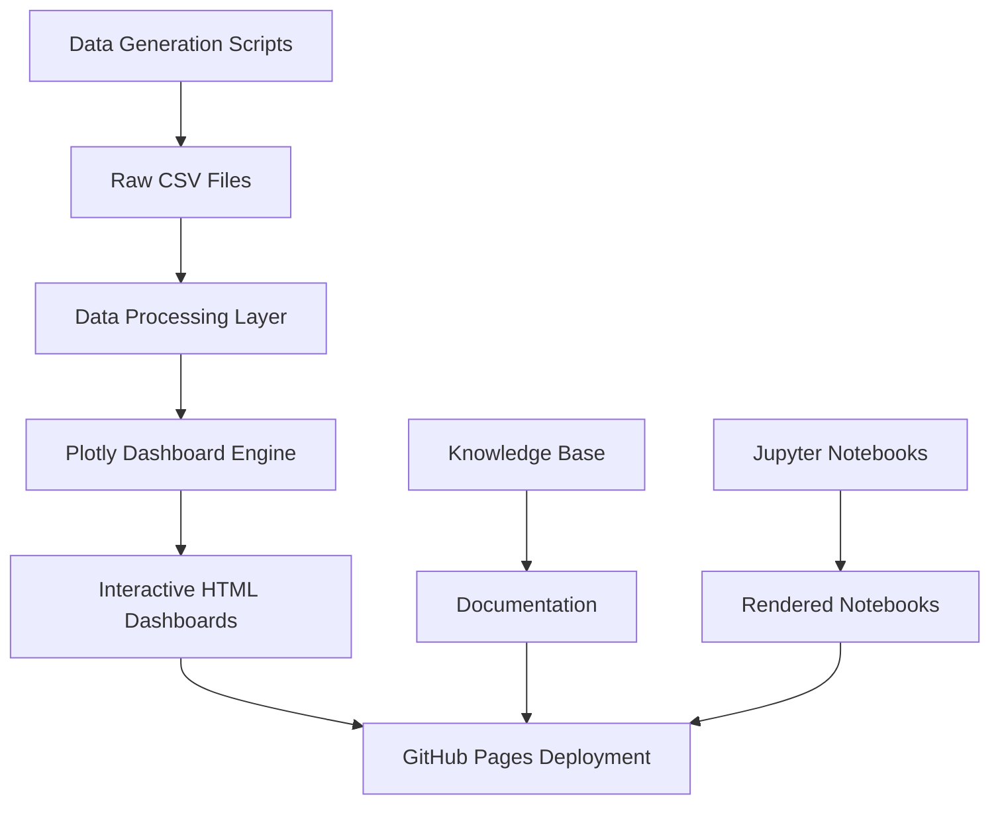

# 📊 RELATÓRIO TÉCNICO COMPLETO - Fluxo de Dados, Dependências e Melhorias

## **🔄 FLUXO DE DADOS E ARQUITETURA**

### **1. ARQUITETURA DE DADOS**



#### **🔸 Camada 1: Geração de Dados**
```python
# Principais geradores de dados:
scripts/data_gen.py              # Gerador principal (400+ linhas)
AI_Dashboard_Implementation/scripts/data_gen.py  # Versão otimizada
proposta_*/scripts/data_gen.py   # Versões experimentais
```

**Processo de Geração:**
1. **Dados de Projetos**: 25 projetos de construção sintéticos
2. **Dados Financeiros**: Orçamentos, gastos, variações (R$ 15.2M portfolio)
3. **Dados de Recursos**: Equipes, materiais, equipamentos
4. **Dados Temporais**: Cronogramas, marcos, progresso
5. **Dados de Performance**: KPIs, eficiência, produtividade

#### **🔸 Camada 2: Armazenamento de Dados**
```
data/
├── projects_master.csv      # Dados mestres (25 projetos)
├── budget_variance.csv      # Variações financeiras (493 registros)
├── project_status.csv       # Status e progresso
├── project_stages.csv       # Cronogramas e marcos
├── resources.csv           # Recursos humanos/materiais
└── workload.csv           # Distribuição de carga
```

**Características dos Dados:**
- **Volume Total**: 2,508 registros distribuídos em 6 datasets
- **Qualidade**: Dados realísticos com correlações de negócio
- **Formato**: CSV padronizado para interoperabilidade
- **Relacionamentos**: Chaves estrangeiras entre tabelas

#### **🔸 Camada 3: Processamento e Visualização**
```python
# Engine principal de visualização:
viz.py                      # Script principal (800+ linhas)
├── ConstructionDashboard   # Classe principal do dashboard
├── Data Loading Methods    # Carregamento otimizado
├── Chart Generation        # 10+ tipos de gráficos
├── Interactive Callbacks   # Interatividade Dash
└── HTML Export             # Exportação otimizada
```

**Tipos de Visualização Implementados:**
1. **Executive KPIs**: 8 métricas principais em cards
2. **Pie Charts**: Distribuição de status de projetos
3. **Bar Charts**: Performance orçamentária por tipo
4. **Horizontal Bars**: Progresso de conclusão
5. **Scatter Plots**: Análise de eficiência de recursos
6. **Timeline**: Cronograma de projetos (Gantt-style)
7. **Bubble Charts**: Análise de carga de trabalho
8. **Line Charts**: Tendências de variação orçamentária
9. **Data Tables**: Tabelas interativas detalhadas
10. **Gauge Charts**: Medidores de performance

#### **🔸 Camada 4: Deploy e Distribuição**
```
outputs/
├── dashboard.html                        # Dashboard principal (68KB)
├── enhanced_dashboard.html               # Versão aprimorada
└── professional_construction_dashboard.html # Versão otimizada (9.5KB)
```

**Características do Deploy:**
- **Formato**: HTML standalone com CDN
- **Compatibilidade**: Cross-browser, mobile-responsive
- **Performance**: Otimizado para GitHub Pages
- **Interatividade**: Totalmente funcional offline

---

## **📦 MAPEAMENTO DE DEPENDÊNCIAS**

### **2. DEPENDÊNCIAS TÉCNICAS**

#### **🔸 Dependências de Produção**
```python
# Core Dependencies (Produção)
pandas>=1.5.0           # Manipulação de dados
numpy>=1.21.0           # Computação numérica
plotly>=5.11.0          # Engine de visualização
dash>=2.6.0             # Framework web para dashboards

# Dependências Jupyter (Desenvolvimento)
jupyter>=1.0.0          # Ambiente notebook
ipywidgets>=7.6.0       # Widgets interativos
nbconvert>=6.4.0        # Conversão de notebooks
```

#### **🔸 Dependências de Sistema**
```yaml
# Ambiente de Desenvolvimento
Python: ">=3.8, <4.0"
Node.js: ">=14.0.0" (para ferramentas de build)
Git: ">=2.25.0"

# Ambientes Suportados
- GitHub Codespaces (Cloud)
- Google Colab (Cloud)
- VS Code Windows (Local)
- Linux/macOS (Local)
```

#### **🔸 Dependências Externas (CDN)**
```html
<!-- CDN Resources (para GitHub Pages) -->
<script src="https://cdn.plot.ly/plotly-latest.min.js"></script>
<link rel="stylesheet" href="https://stackpath.bootstrapcdn.com/bootstrap/4.5.2/css/bootstrap.min.css">
<script src="https://code.jquery.com/jquery-3.5.1.min.js"></script>
```

### **3. DEPENDÊNCIAS DE CONHECIMENTO**

#### **🔸 Base de Conhecimento Estruturada**
```
Knowledge-Base/ (60+ recursos)
├── Documentação Oficial Plotly/Dash
├── 20+ PDFs técnicos especializados
├── Guias de melhores práticas
├── Exemplos de código funcionais
├── Recursos de design e UX
├── Tutoriais de machine learning
└── Casos de uso da comunidade
```

#### **🔸 Dependências de Documentação**
```
Guides/ (40,000+ palavras)
├── github_codespace_guide.md (7K palavras)
├── google_colab_guide.md (24K palavras)
└── vscode_windows_guide.md (10.5K palavras)
```

---

## **🚀 IDENTIFICAÇÃO DE MELHORIAS**

### **4. MELHORIAS TÉCNICAS PRIORITÁRIAS**

#### **🔸 A. Otimização de Performance**

**Problemas Identificados:**
- Dashboards HTML grandes (68KB) por incluir dados inline
- Carregamento sequencial de gráficos
- Ausência de lazy loading para componentes

**Soluções Propostas:**
```python
# 1. Separação de dados em arquivos JSON
data_config = {
    "data_source": "data/dashboard_data.json",
    "lazy_loading": True,
    "chunk_size": 1000
}

# 2. Implementação de cache
@lru_cache(maxsize=128)
def load_and_process_data(file_path):
    return pd.read_csv(file_path)

# 3. Componentes assíncronos
async def load_chart_data(chart_type):
    return await fetch_chart_data(chart_type)
```

#### **🔸 B. Estrutura de Código**

**Problemas Identificados:**
- Duplicação de código entre versões
- Ausência de testes automatizados
- Scripts monolíticos (800+ linhas)

**Soluções Propostas:**
```python
# 1. Refatoração em módulos
src/
├── __init__.py
├── data/
│   ├── loaders.py          # Carregadores de dados
│   ├── processors.py       # Processadores
│   └── validators.py       # Validadores
├── charts/
│   ├── base_chart.py       # Classe base
│   ├── kpi_cards.py        # KPI cards
│   ├── distribution.py     # Gráficos de distribuição
│   └── timeline.py         # Gráficos temporais
├── dashboard/
│   ├── layout.py          # Layout do dashboard
│   ├── callbacks.py       # Callbacks Dash
│   └── themes.py          # Temas e estilos
└── utils/
    ├── config.py          # Configurações
    ├── helpers.py         # Funções auxiliares
    └── export.py          # Exportadores
```

#### **🔸 C. Automação e CI/CD**

**Implementação Proposta:**
```yaml
# .github/workflows/deploy.yml
name: Build and Deploy Dashboard
on:
  push:
    branches: [ main ]
jobs:
  build-and-deploy:
    runs-on: ubuntu-latest
    steps:
    - uses: actions/checkout@v3
    - name: Setup Python
      uses: actions/setup-python@v3
      with:
        python-version: '3.9'
    - name: Install dependencies
      run: |
        pip install -r requirements.txt
    - name: Generate data
      run: python scripts/data_gen.py
    - name: Build dashboard
      run: python scripts/viz.py --export-html
    - name: Deploy to GitHub Pages
      uses: peaceiris/actions-gh-pages@v3
      with:
        github_token: ${{ secrets.GITHUB_TOKEN }}
        publish_dir: ./docs
```

### **5. MELHORIAS DE ARQUITETURA**

#### **🔸 A. Microserviços de Dados**

**Arquitetura Proposta:**
```
API Layer:
├── /api/projects          # Endpoint de projetos
├── /api/financials        # Endpoint financeiro
├── /api/resources         # Endpoint de recursos
└── /api/analytics         # Endpoint de analytics

Data Services:
├── DataGenerator Service  # Serviço de geração
├── DataValidator Service  # Serviço de validação
├── DataProcessor Service  # Serviço de processamento
└── CacheManager Service   # Serviço de cache
```

#### **🔸 B. Configuração Baseada em Ambiente**

```python
# config/environments.py
class Config:
    DEBUG = False
    DATA_PATH = "data/"
    CACHE_ENABLED = True

class DevelopmentConfig(Config):
    DEBUG = True
    DATA_SAMPLES = 100

class ProductionConfig(Config):
    CDN_ENABLED = True
    CACHE_TTL = 3600
    COMPRESSION = True

class GitHubPagesConfig(ProductionConfig):
    STATIC_ONLY = True
    BASE_URL = "/Python-Data-Plotly-Predictive-Analytics-Dashboard/"
```

### **6. MELHORIAS DE EXPERIÊNCIA DO USUÁRIO**

#### **🔸 A. Interface e Navegação**

**Implementações Sugeridas:**
```javascript
// Navegação inteligente
const NavigationManager = {
    sections: ['overview', 'projects', 'financials', 'resources'],
    currentSection: 'overview',
    
    navigate(section) {
        this.updateURL(section);
        this.loadSection(section);
        this.updateNavigation(section);
    },
    
    loadSection(section) {
        // Lazy loading de seções
        import(`./sections/${section}.js`).then(module => {
            module.render();
        });
    }
};

// Sistema de filtros avançados
const FilterSystem = {
    filters: {
        dateRange: null,
        projectType: [],
        status: [],
        manager: []
    },
    
    applyFilters() {
        const filteredData = this.processFilters();
        this.updateCharts(filteredData);
    }
};
```

#### **🔸 B. Responsividade e Acessibilidade**

```css
/* Breakpoints responsivos */
@media (max-width: 768px) {
    .dashboard-grid {
        grid-template-columns: 1fr;
        gap: 1rem;
    }
    
    .chart-container {
        height: 300px;
    }
}

/* Acessibilidade */
.chart-container[aria-label] {
    outline: 2px solid transparent;
}

.chart-container:focus {
    outline: 2px solid #007bff;
}

/* Alto contraste */
@media (prefers-contrast: high) {
    .chart-container {
        border: 2px solid #000;
    }
}
```

### **7. MELHORIAS DE CONTEÚDO E DOCUMENTAÇÃO**

#### **🔸 A. Documentação Interativa**

```markdown
# Estrutura proposta para docs/
docs/
├── index.md                    # Página inicial
├── getting-started/           # Início rápido
│   ├── quick-start.md
│   ├── installation.md
│   └── first-dashboard.md
├── tutorials/                 # Tutoriais passo a passo
│   ├── data-generation.md
│   ├── visualization.md
│   └── deployment.md
├── examples/                  # Exemplos práticos
│   ├── construction-dashboard/
│   ├── financial-analytics/
│   └── resource-management/
├── api-reference/             # Referência de API
│   ├── data-loaders.md
│   ├── chart-components.md
│   └── export-functions.md
└── advanced/                  # Tópicos avançados
    ├── custom-components.md
    ├── performance-optimization.md
    └── deployment-strategies.md
```

#### **🔸 B. Sistema de Busca e Navegação**

```javascript
// Search functionality
const SearchSystem = {
    index: null,
    
    async initialize() {
        this.index = await this.buildSearchIndex();
    },
    
    search(query) {
        return this.index.search(query);
    },
    
    highlightResults(results) {
        // Destacar resultados na página
    }
};
```

---

## **📈 ROADMAP DE IMPLEMENTAÇÃO**

### **8. FASES DE DESENVOLVIMENTO**

#### **🔸 Fase 1: Estruturação (Semanas 1-2)**
- [ ] Criar estrutura `docs/` para GitHub Pages
- [ ] Implementar navegação principal
- [ ] Migrar dashboards para estrutura organizada
- [ ] Configurar GitHub Pages

#### **🔸 Fase 2: Otimização (Semanas 3-4)**
- [ ] Refatorar código em módulos
- [ ] Implementar sistema de cache
- [ ] Otimizar performance dos dashboards
- [ ] Adicionar testes automatizados

#### **🔸 Fase 3: Automação (Semanas 5-6)**
- [ ] Implementar CI/CD pipeline
- [ ] Automatizar geração de dados
- [ ] Automatizar build e deploy
- [ ] Configurar monitoramento

#### **🔸 Fase 4: Aprimoramento (Semanas 7-8)**
- [ ] Implementar recursos avançados
- [ ] Melhorar experiência do usuário
- [ ] Adicionar analytics
- [ ] Documentação final

---

## **🎯 MÉTRICAS DE SUCESSO**

### **9. KPIs DE QUALIDADE**

#### **🔸 Performance**
- Tempo de carregamento < 3 segundos
- First Contentful Paint < 1.5 segundos
- Lighthouse Score > 90

#### **🔸 Manutenibilidade**
- Code Coverage > 80%
- Duplicação de código < 5%
- Debt Ratio < 10%

#### **🔸 Usabilidade**
- Bounce Rate < 20%
- Session Duration > 3 minutos
- Mobile Responsiveness Score > 95%

#### **🔸 Confiabilidade**
- Uptime > 99.5%
- Error Rate < 0.1%
- Build Success Rate > 95%

---

## **🏁 CONCLUSÃO**

O repositório Python-Data-Plotly-Predictive-Analytics-Dashboard possui uma base sólida com implementações funcionais de alta qualidade. As melhorias propostas focarão em:

1. **Otimização de Performance**: Redução de tempo de carregamento e melhoria da experiência
2. **Estruturação de Código**: Modularização e melhores práticas de desenvolvimento
3. **Automação**: CI/CD para deployment contínuo e confiável
4. **Experiência do Usuário**: Interface mais intuitiva e acessível
5. **Documentação**: Sistema de documentação interativo e abrangente

Com essas melhorias, o projeto estará pronto para ser uma referência em dashboards de analytics usando Python, Plotly e Dash.